# Credit_Risk_Analysis

## Overview of the Analysis
> The purpose of this project was to apply machine learning to solve a real-world challenge: credit card risk.

> Credit risk is an inherently unbalanced classification problem, as good loans easily outnumber risky loans. Therefore, I needed to employ different techniques to train and evaluate models with unbalanced classes. Specifically, imbalanced-learn and scikit-learn libraries to build and evaluate models using resampling.

> Using the credit card credit dataset from LendingClub, a peer-to-peer lending services company, I performed oversample of the data using the RandomOverSampler and SMOTE algorithms, and undersampled the data using the ClusterCentroids algorithm. Then, a combinatorial approach of over- and undersampling using the SMOTEENN algorithm. Finally, I was able to compare two new machine learning models that reduce bias, BalancedRandomForestClassifier and EasyEnsembleClassifier, to predict credit risk.

## Results
### Balanced Accuracy Score and the precision and recall scores

- 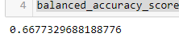 
  - ***Naive Oversampling***
- 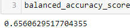
  - ***SMOTE Oversampling***
- 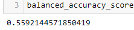
  - ***Undersampling***
- 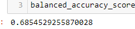
  - ***Combination Sampling***
- 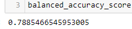
  - ***BRF Classifier***
- 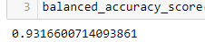
  - ***Easy Ensemble Classifier***
#### Discussion
> The accuracy of a learning model is a measure of what percentage of the testing set the model predicted correctly. There does seem to be some variation in the accuracy score of the different models. In general, the Undersampling method seemed to perform the worst at only 56%, whereas the Oversampling and Combination methods seemed to perfrom slightly better at around 66-69%. When I utilized the ensemble models, Balanced Random Forest and Easy Ensemble Classifiers, the accuracy increased to 79% and 93% respectively. 
> So, it does seem that the ensemble methods ourperformed the over/under sampling models fairly signficantly with the Easy Ensemble Classified being the most accurate. 
  
### Precision and Recall scores  
- 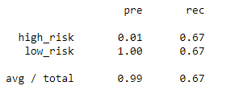 
  - ***Naive Oversampling***
- 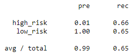
  - ***SMOTE Oversampling***
- 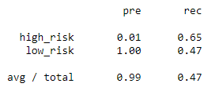
  - ***Undersampling***
- 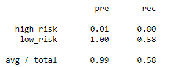
  - ***Combination Sampling***
- 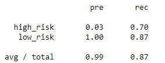
  - ***BRF Classifier***
- 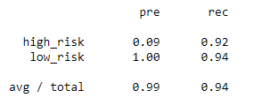
  - ***Easy Ensemble Classifier***
## Summary

